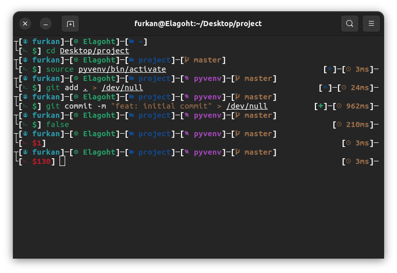

# Elagoht ZSH THEME


This is a powerfull two line oh-my-zsh prompt theme. 



There is also a safe version without icons. You can safely use it on TTY and Termux or something else.

## Requirements 

* Install oh-my-zsh on [https://ohmyz.sh](https://ohmyz.sh)
* Default version requires any of a nerd font.

## Features:

* Non-root user's name shown cyan, root user's name shown red.
* Local machine's name shown green, ssh machine's name shown yellow.
* Only 2 subfolder shown in indicator.
* Virtual environment indicator support.
* Git indicator support.
* Git Status Badges at right prompt.
* Command execution time on right prompt.
* Exit status shown if non-zero.

## Installation

Here is a one-liner installation code...

...for default theme:

```sh
curl -sfSL "https://raw.githubusercontent.com/Elagoht/Elagoht.zsh-theme/main/install.sh" | bash
```

...for safe (iconless) theme:

```sh
curl -sfSL "https://raw.githubusercontent.com/Elagoht/Elagoht.zsh-theme/main/install.sh" | bash safe
```
